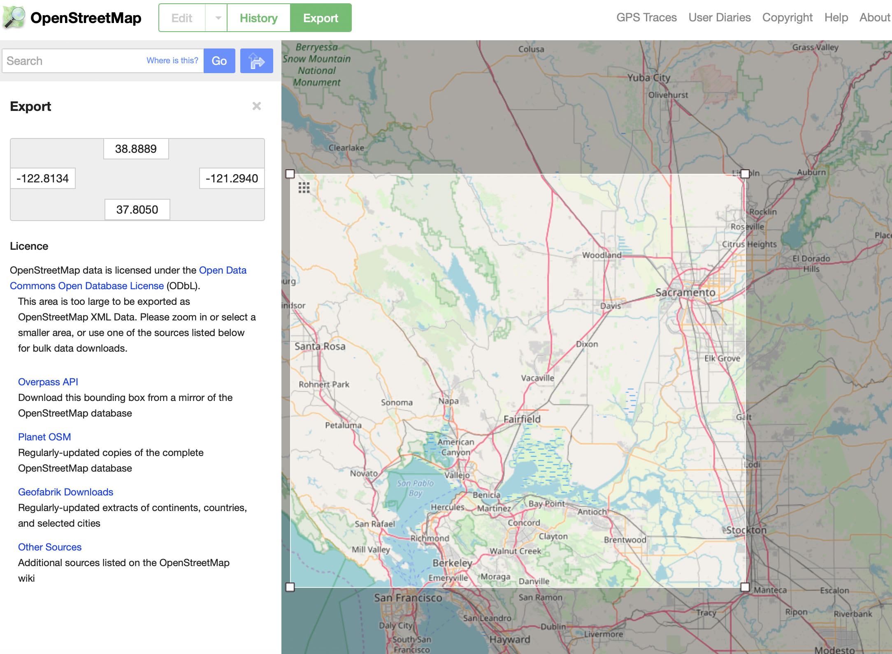
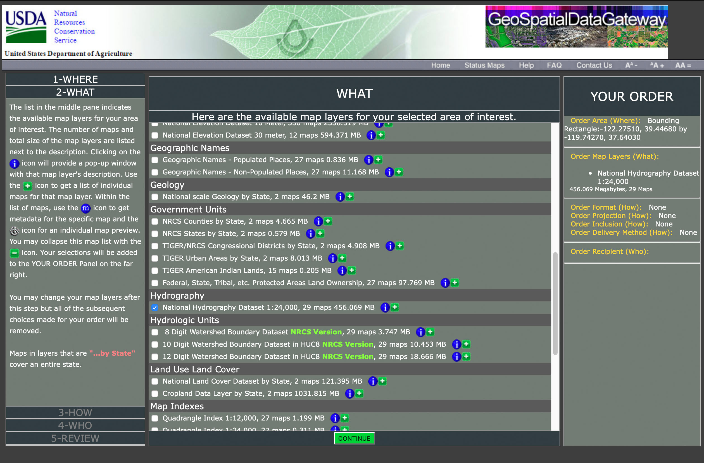
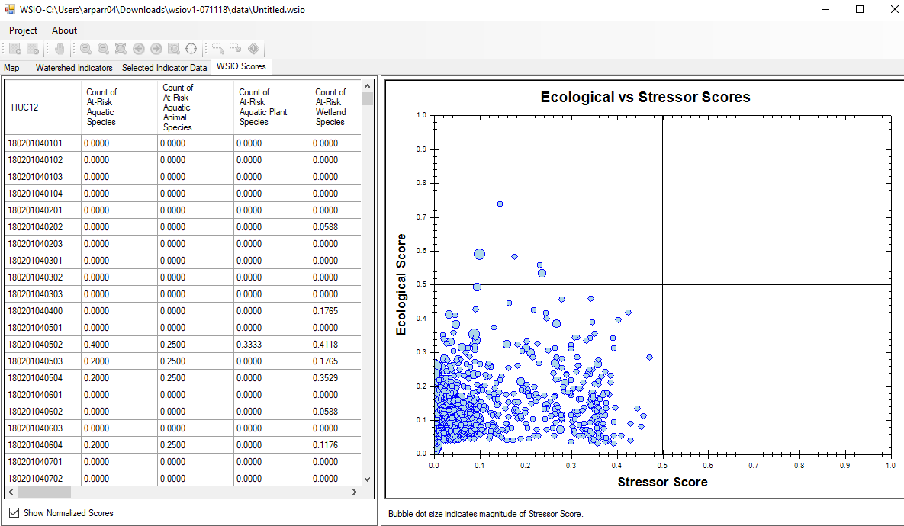
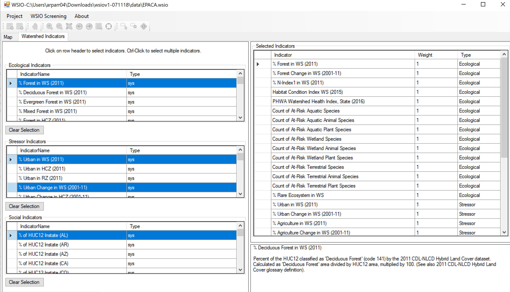
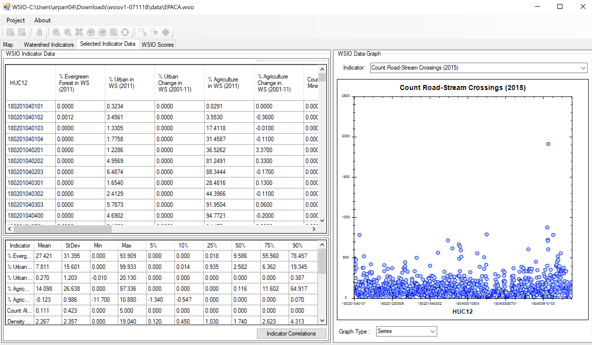

## Western Watersheds & Biodiversity

### I. Introduction

This map seeks to explore a possible relationship between water reclamation projects and biodiversity in western watersheds. There is an overwhelming amount of data and a lot of confusing measurements that federal agencies use to track the health of the environment (see [resources](#resources) below for some examples). My goal is to create a compelling story map that helps users understand a geographic feature (watersheds) that regulatory agencies (like the EPA) use to organize information about water. Specifically, I looked to see if there was a noticeable pattern between at-risk species by watershed (the EPA measures this) and the location of major water reclamation projects (which are managed by the Bureau of Reclamation).

I do not have much (any) background knowledge in ecology or hydrology, so I am approaching this project as a journalist. I expect that the map user is equally uninformed, so the narrative structure of the story map echo my research process. The map opens on the highest level of watersheds and introduces the concept of watersheds. As the user progresses through the map, the watersheds break down into smaller components and additional data layers are added. 

### II. Methodology

Using data collected from the USGS, EPA, and USBR, this map demonstrates the complexity of watershed management in the western United States. Hydrologic unit codes (HUCs) are the boundary levels. As the user progresses through the map, the boundary level changes and additional data populates.

Following are the HUCs:
* 2-digit HUC (region)
* 4-digit HUC (sub-region)
* 6-digit HUC (basin)
* 8-digit HUC (sub-basin)
* 10-digit HUC (watershed)
* 12-digit HUC (sub-watershed)

#### A. Data

This map is primarily focused on 4 of the 22 water resource regions (HUC2). Specifically:

[USGS Watershed Boundary Dataset](https://www.usgs.gov/core-science-systems/ngp/national-hydrography/watershed-boundary-dataset?qt-science_support_page_related_con=4#qt-science_support_page_related_con):
* Great Basin (HUC16n - EPA8/9)
* Lower Colorado (HUC15 - EPA9/8)
* Pacific Northwest (HUC17 - EPA10)
* California (HUC18 - EPA9)

**USGS Boundaries**
I downloaded shapefiles for the six levels of watersheads for the four regions. I combined the shapefiles at each HUC level, updated the CRS to EPSG:4326, and convert the shapefiles to geojsons using gdal/ogr2ogr. Once that task was complete I simplified the large geojson files, sometimes using mapshaper in Node and sometimes using the [Mapshaper](https://mapshaper.org) web tool. These files are labeled watersheds-HUCX.geojson.
 * [watersheds-huc2.geojson](data/watersheds-huc2.geojson)
 * [watersheds-huc4.geojson](data/watersheds-huc4.geojson)
 * [watersheds-huc6.geojson](data/watersheds-huc6.geojson)
 * [watersheds-huc8.geojson](data/watersheds2-12/watersheds-huc8.geojson)
 * [watersheds-huc10.geojson](data/watersheds2-12/watersheds-huc10.geojson)
 * [watersheds-huc12.geojson](data/watersheds2-12/watersheds-huc12.geojson)

I frequently used [geoJSON.io](http://geojson.io/#map=2/20.0/0.0) to check the files.

**USGS NHD Data**
The hydro and stations layers ultimately came from the USGS's National Hydrography Database, but I took a few step to get there: First I used OpenStreetMaps to get bounding box coordinates for the area for which I wanted hydro data:

Then I used the Natural Resources Conservation Service's [GeoSpatialDataGateway](https://datagateway.nrcs.usda.gov/GDGOrder.aspx?order=MBROrder) to select the datasets I wanted to download for that region:

From there, I examined the shapefiles in QGIS, changed the CRS, and exported the layers as GeoJSONs. These layers are areas for potential improvement. The NHD is a massive dataset...
* [water-monitoring-stations](data/stations.geojson)
* [hydro](data/hydro1.geojson)

**EPA Data**
* Watershed Index Online [(WSIO) Indicator Library](https://www.epa.gov/wsio/wsio-indicator-data-library) (Regions 8-10)

I used both the spreadsheet WSIO Indicator Data for EPA Regions 8-10 as well as the [WSIO Tool](https://www.epa.gov/wsio/download-and-use-wsio-tool) to review the 460 data points the EPA collects for each sub-watershed (HUC12). One of the most complicated parts of this project was decoding the language and choosing data points to include in my map. I started with the At-Risk Species information as it was directly related to my initial question: *Is there a relationship between water reclamation projects and biodiversity?* 

Showing symbolized HUC12s for all four regions (thousands of polygons) was not useful, so I took the largest HUC12 values for At-Risk Species in each of the HUC8s (my assumption was that the HUC12s had more in commmon than not and that it would be unlikely for each HUC12 in a HUC8 area to have different At-Risk Species) and created a summary EPA-HUC8 spreadsheet to join to the watersheds-huc8.geojson on the HUC8 value.
* [epa-huc8.geojson](data/epa-huc8.geojson) 

As the project developed, and I became more familiar with different types of data available and the different agencies collecting the data (note that the WSIO data is aggregated by the EPA, but multiple agencies are involved in the production of the data), I selected additional data points that were used to create the thematic maps centered around Lake Berryessa and the Monticello Dam.

Following are examples of data selection and visualization in the WSIO tool, which is only available on Windows OS right now: 

**USBR Points**
This interactive [map](https://water.usbr.gov/RWISmap.php) has downloadable info about projects by HUC. This was the first tool I used on the USBR website. I had to download four csv files (by water resource region) and used a CSV to JSON tool to create the combined points file.
 * [usbrpoints.json](data/usbrpoints.geojson)

Unfortunately, while the USBR does a good job of providing general stats, it does not have a shapefile or a spreadsheet with the names and locations of all of its projects. I attempted to get this information by scraping the [Projects](https://www.usbr.gov/projects/facilities.php?type=Project) pages of the website using Octoparse. I had some success, but location data was incomplete. I attempted to collect the data from other sources (i.e. Dam locations from the Department of Transportation, Powerplants from the Department of Energy, etc.), but elected to stick with the original USBR data for the sake of not further complicating things.

Early in the project, I created prototype of the EPA and USGS data joined using CartoDB:<iframe width="100%" height="520" frameborder="0" src="https://nmp.carto.com/u/andrearparr/builder/bc8fb5c2-6647-42d8-8c1d-4921a4ca09e5/embed" allowfullscreen webkitallowfullscreen mozallowfullscreen oallowfullscreen msallowfullscreen></iframe>

#### B. Medium for delivery

This is a scroll-based story map that will use a variety of technologies including HTML, CSS, JavaScript and Leaflet. I am primarily using the [storymap.js library by Bo Zhao](https://github.com/jakobzhao/storymap) with some (minor) modifications to the library.

#### C. Application layout

Story map flow:
* Opens on map of HUC2 watersheds. Copy in transparent box to the left provides an introduction to watersheds.
* Scene 2 shows HUC4 areas and goes into more detail about the history and unique needs of western watersheds. There is a slight zoom.
* Scene 3 shows HUC6 areas and introduces the complexities of water resource management
* Scene 4 adds EPA data. This is symbolized as a choropleth map.
* Scene 5 adds point level data for water reclamation project locations
* Scene 6 zooms into the Lake Berryessa Region and provides some history
* Scene 7 shows ecological data points (choropleth map)
* Scene 8 shows stressors (chroropleth map)
* Scene 9 shows social indicators (chroropleth map)
* Scene 10 is the conclusion and a list of resources

See an early [wireframe sketch](wireframes/wireframe-watersheds) for the proposed flow

#### D. Thematic representation

Aggregate data from WISO is be represented in a choropleth map organized by sub-watersheds. Locations of reclamation projects will be represented as points. 

#### E. User interaction

This map is divided into scenes and the user progresses through them by scrolling. When the user hovers over an area on the map, a tooltip with additional information populates.

#### F. Aesthetics and design considerations

The goal of the map is to be clean and modern. The data here is complicated and unfamiliar, so the design should try to streamline information. I am interested in bringing in design elements (palettes, typefaces, etc) that are represent featured locations.

### III. Conclusion

By the end of exploring this map, my goal is for the users to have a better understanding of what a watershed is and why it's a useful administrative unit. Additionally, I hope to highlight the breadth of water reclamation projects that and highlight their impact on sub-watersheds and the species that live in those areas. I do not expect to draw definitive conclusions, this project is about learning more about the connection between water management and biodiversity.

Ideally this type of map could help users develop a vocabulary to better understand environmental data and perhaps advocate for their interests.

####  Additional Resources

* There's a whole [Bureau of Reclaimation](https://www.usbr.gov) that has project information, news releases, and the [Reclamation Water Information System](https://water.usbr.gov/) which has "machine readable water datasets to use as input for models and analyses via automated data exchange via webservice.
* USBR made a neat storymap on [Irrigation Demand Projections](https://usbr.maps.arcgis.com/apps/MapJournal/index.html?appid=f08c6c521fe64e259b3da9771b948204).
* The EPA has an [EnviroAtlas](https://www.epa.gov/enviroatlas/enviroatlas-data-download-step-2) with data downloads. Their [interactive map](https://enviroatlas.epa.gov/enviroatlas/interactivemap/) has data on species at risk. 
* The EPA also has a [Surf Your Watershed](https://www.epa.gov/waterdata/surf-your-watershed) page that has, among other things, breakdowns of the 10 EPA regions (I am interested in 8-10) and (THERE IS SO MUCH DATA) and [national GIS datasets](https://www.epa.gov/wsio/wsio-indicator-data-library#huc).
* Endangered species info is available at [FWS](https://www.fws.gov/endangered/species/index.html).
* [Western Waters Digital Library](http://westernwaters.org) has primary and secondary resources on water in the western US. Archival materials. This would be a good source for old maps to georeference (among many other things).
* [Western Watersheds Project](https://www.westernwatersheds.org/about/) has news releases, action alerts, some general info about [species protection](https://www.westernwatersheds.org/issues/species/).
* Some potentially useful data from [Fish & Wildlife](https://ecos.fws.gov/ServCat/). Maybe [FWS Ecrosystem Regions](https://ecos.fws.gov/ServCat/Reference/Profile/74343)? will have interesting/useful layers?
* USGS has a [Watershed Boundary Dataset](https://www.usgs.gov/core-science-systems/ngp/national-hydrography/watershed-boundary-dataset?qt-science_support_page_related_con=4#qt-science_support_page_related_con) that may be useful as a layer.
* USGS's [ScienceBase-Catalog](https://www.sciencebase.gov/catalog/) may have other potential layers.
* USGS has [water budget](https://cida.usgs.gov/nwc-static/waterbudget-viz/) info - water budgets are "used to understand the movement of water into and out of a watershed". There might be something interesting here?
* The [Center for Biological Diversity](https://www.biologicaldiversity.org) has some basic information about endangered amphibians, birds, fish, invertebrates, mammals, plants, and reptiles.

#### Story maps for inspiration
Following are some storymaps that I've enjoyed.
* [Borderline](https://www.washingtonpost.com/graphics/2018/national/us-mexico-border-flyover/?utm_term=.27ecb945b600), Washington Post
* [Murder with impunity](https://www.washingtonpost.com/graphics/2018/politics/midterm-election-precinct-results/?utm_term=.cba9b1786834), Washington Post.

