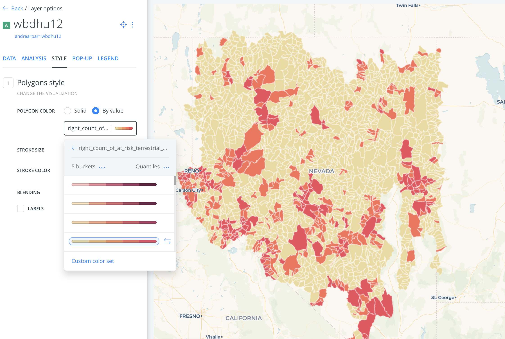

## Western Watersheds & Biodiversity

### Topic: 
Examine the relationship between reclaimation projects in western watersheds and threatened species...

Questions to think about:
1. What do I want to get out of this project?
*I would like to understand more about the impact reclamation projects have on native species*
2. What will the user get out of the deliverable?
*A neat story map that has some information about the impact water projects have on the environment*
3. What does a successful map or implementation of the interface look like?
*I'm not sure yet, but I'm saving storymaps for inspriation below. Possible solution: start with map of watersheds & intro narrative, map of reclamation projects & more copy, close up maps of areas with at-risk species (could be birds, plants, mammals, reptiles, etc.)...more copy. 

#### Data:
*I have downloaded a number of large, confusing datasets about watersheds.*
* USGS has shapefiles for watersheds. 
* THe EPA WSIO has at-risk species info by Hyrologic Unit Code (HUC12), which can be joined to the USGS shapefile. There is A LOT of info in this file, I hid many of the columns, but need to spend more time checking to see if there is anything else that would be useful. Not sure if historic info is available.

I'm currently looking at these two layers in Carto and QGIS. Here's what some sample data I've pulled into Carto looks like

This shows one of four watershed regions I'm looking at. The dark colors show regions with at risk terrestrial plants. 

* USBR has a [Reclamation Water Information System](https://water.usbr.gov/) which has an API. I would like to figure out how to get the point data for the project sites from this source (it's clearly available on this [map](https://water.usbr.gov/RWISmap.php) - I don't know how to get to it yet.

#### Resources
* There's a whole [Bureau of Reclaimation](https://www.usbr.gov) that has project information, news releases, and the [Reclamation Water Information System](https://water.usbr.gov/) which has "machine readable water datasets to use as input for models and analyses via automated data exchange via webservice.
* USBR made a neat storymap on [Irrigation Demand Projections](https://usbr.maps.arcgis.com/apps/MapJournal/index.html?appid=f08c6c521fe64e259b3da9771b948204).
* The EPA has an [EnviroAtlas](https://www.epa.gov/enviroatlas/enviroatlas-data-download-step-2) with data downloads. Their [interactive map](https://enviroatlas.epa.gov/enviroatlas/interactivemap/) has data on species at risk. 
* The EPA also has a [Surf Your Watershed](https://www.epa.gov/waterdata/surf-your-watershed) page that has, among other things, breakdowns of the 10 EPA regions (I am interested in 8-10) and (THERE IS SO MUCH DATA) and [national GIS datasets](https://www.epa.gov/wsio/wsio-indicator-data-library#huc).
* Endangered species info is available at [FWS](https://www.fws.gov/endangered/species/index.html).
* [Western Waters Digital Library](http://westernwaters.org) has primary and secondary resources on water in the western US. Archival materials. This would be a good source for old maps to georeference (among many other things).
* [Western Watersheds Project](https://www.westernwatersheds.org/about/) has news releases, action alerts, some general info about [species protection](https://www.westernwatersheds.org/issues/species/).
* Some potentially useful data from [Fish & Wildlife](https://ecos.fws.gov/ServCat/). Maybe [FWS Ecrosystem Regions](https://ecos.fws.gov/ServCat/Reference/Profile/74343)? will have interesting/useful layers?
* USGS has a [Watershed Boundary Dataset](https://www.usgs.gov/core-science-systems/ngp/national-hydrography/watershed-boundary-dataset?qt-science_support_page_related_con=4#qt-science_support_page_related_con) that may be useful as a layer.
* USGS's [ScienceBase-Catalog](https://www.sciencebase.gov/catalog/) may have other potential layers.
* USGS has [water budget](https://cida.usgs.gov/nwc-static/waterbudget-viz/) info - water budgets are "used to understand the movement of water into and out of a watershed". There might be something interesting here?
* The [Center for Biological Diversity](https://www.biologicaldiversity.org) has some basic information about endangered amphibians, birds, fish, invertebrates, mammals, plants, and reptiles.

#### Story maps for inspiration
Following are some storymaps that I've enjoyed.
* [Borderline](https://www.washingtonpost.com/graphics/2018/national/us-mexico-border-flyover/?utm_term=.27ecb945b600), Washington Post
* [Murder with impunity](https://www.washingtonpost.com/graphics/2018/politics/midterm-election-precinct-results/?utm_term=.cba9b1786834), Washington Post.

